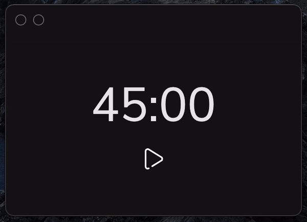

# Time Tracker Application

With this application, you can use the pomodoro technique to track the time spent in activities and increase productivity.

<p align="center" >
  
</p>

### Download

- MAC OS - V2.0 (BETA) : https://mega.nz/file/kNwmACgB#FtEslsf4_KCrQvo09iuOHUq2OZmludlvRK5_g-JByuY
- Linux - V2.0 (BETA) : https://mega.nz/file/0UwjUYyQ#yZxzz5ZiJJaxygNU0v_-MhrSv-EMyG3IOQqYQ78_e3s

### Build the app from source code

Clone the repo and run the following commands on the root folder to install all dependencies and build the React files:

```bash
npm install && npm run build
```

Now you can run one of the commands below according to the OS to create the executable app file:

```bash
npm run package-mac # MACOS command
npm run package-linux # Linux command
npm run package-win # Windows command (not tested)
```

### What I used on this project

- Electron
- Javascript
- React
- CSS
- Electron-builder
- Node.js
- Notification API
